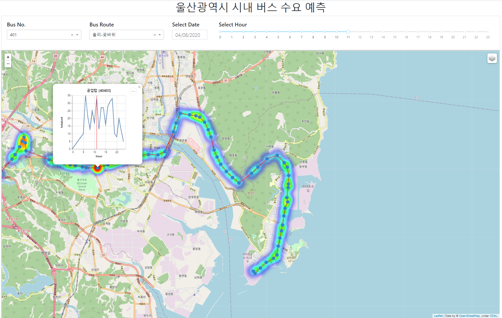

# Passenger_Demand

## 울산광역시 탑승 수요 예측 모델
### (401번 버스)
 
공공 데이터를 활용하여 시내버스 탑승 수요 예측 모델을 구현.  

기준이 되는 교통카드 데이터(마이비 카드 이력 정보(울산광역시))를 제외하고는 API를 통해 자동 수집되도록 처리하였으며, 수집/전처리/예측 까지 한번에 수행할 수 있도록 함.  
데이터 수집/전처리/예측 자동화 시스템을 구현하는 것이 목적이므로, 모델의 예측 성능에 초점을 맞추진 않음.  
(MAE : 1.49, MSE : 2.75)

---
### 분석 데이터 종류
 

|데이터 원천|종류|데이터 상세 명|파일 형태|수집 방법|
|----------|--|-----|----|----|
|교통 데이터 거래소|교통카드 데이터|마이비 카드 이력 정보(울산광역시)|Zip(약 200개)|다운로드|
|공공 데이터 포털|정류소 좌표 데이터|울산광역시_버스 정류소 위치 정보|CSV|다운로드|
|공공 데이터 포털|특일(공휴일, 명절) 데이터|특일 정보|XML|API|
|공공 데이터 포털|기상 데이터|지상(종관, ASOS) 시간자료 조회서비스|JSON/XML|API|
|공공 데이터 포털|미세먼지 경보 데이터|한국환경공단_에어코리아_미세먼지 경보 발령 현황|JSON/XML|API|
|공공 데이터 포털|축제 데이터|전국문화축제표준데이터|JSON/XML|API|
|공공 데이터 포털|행사 데이터|전국공연행사정보표준데이터|JSON/XML|API|
|공공 데이터 포털|상권 데이터|소상공인시장진흥공단_상가(상권)정보|JSON/XML|API|
|공공 데이터 포털|병원 데이터|건강보험심사평가원_병원정보서비스|JSON/XML|API|
|공공 데이터 포털|학교(초,중,고) 데이터|전국초중등학교위치표준데이터|JSON/XML|API|
|커리어넷|대학교 데이터|학교정보|JSON/XML|API|

---
### 분석 모델
* model/Data_Load : API를 통해 데이터를 수집하는 모듈  
* model/Preprocessing : 데이터 전처리 모듈  
 
**pycaret** 라이브러리를 활용하여 모델링 부분의 코드를 최대한 단순화하고, 이를 통해 모델 개선 및 다양한 실험을 용이하게 함.

---
### 시각화
model/main.ipynb 에서 모델링을 수행한 예측 결과(predict_data.csv)를 data에 저장하여 이를 Viz/folium_viz.py에서 활용하여 시각화.  
Dash + Folium 라이브러리를 활용하여 지도에 Interactive한 시각화 화면을 구현.

